# 1. Server Installation & Initial Configuration (10 marks)

**Owner:** Ntokozo Tyanase
**Status:** ✅ Done

## Objective
Install Windows Server 2019, rename the server with the group naming convention,
assign a static IP address, and confirm basic network connectivity.

## Steps

### 1.1 Install Windows Server 2019
- Boot the VM from the Windows Server 2019 ISO.
- Select edition: Windows Server 2019 Standard Evaluation (Desktop Experience).
- Choose "Custom: Install Windows only" and select the target disk.
- Set the local Administrator password.
- Wait for installation to complete.

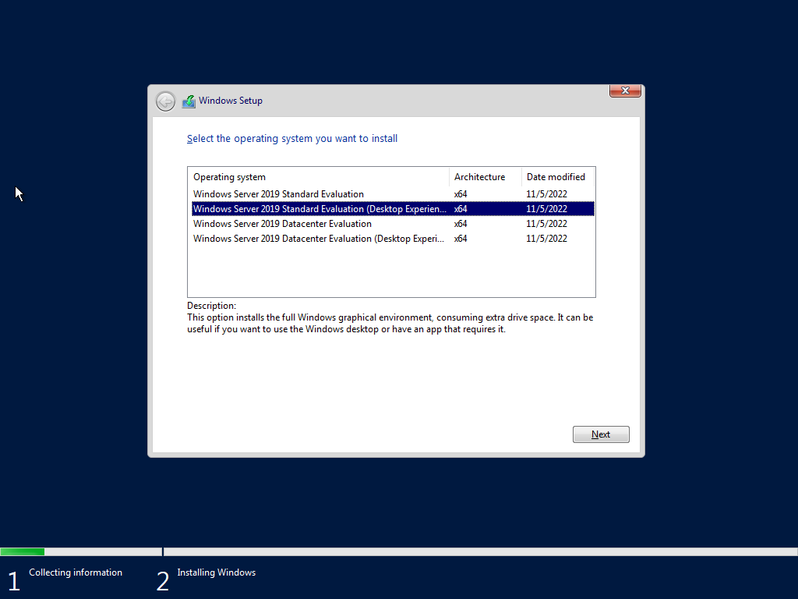
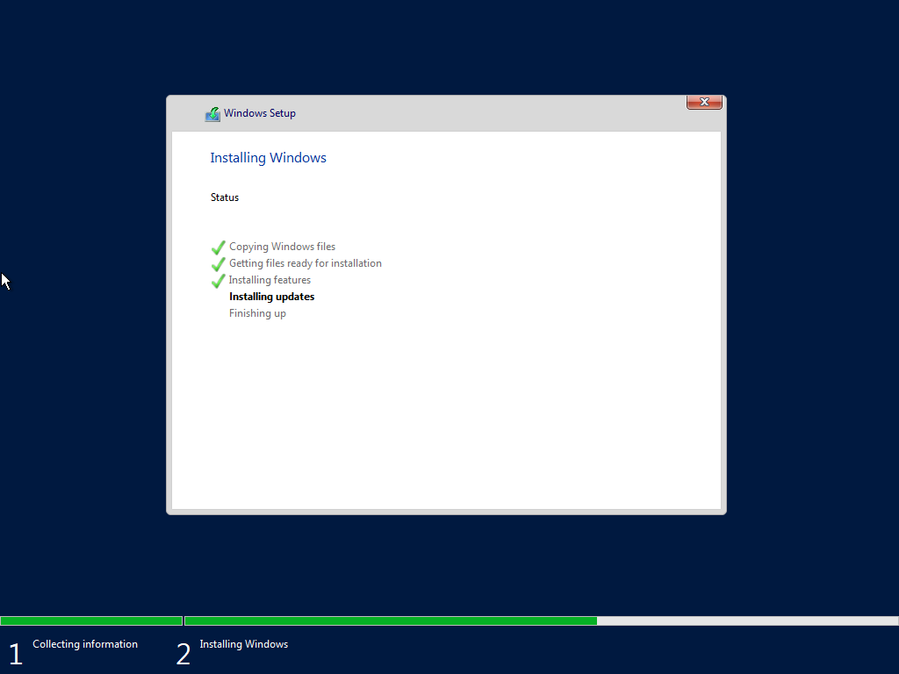
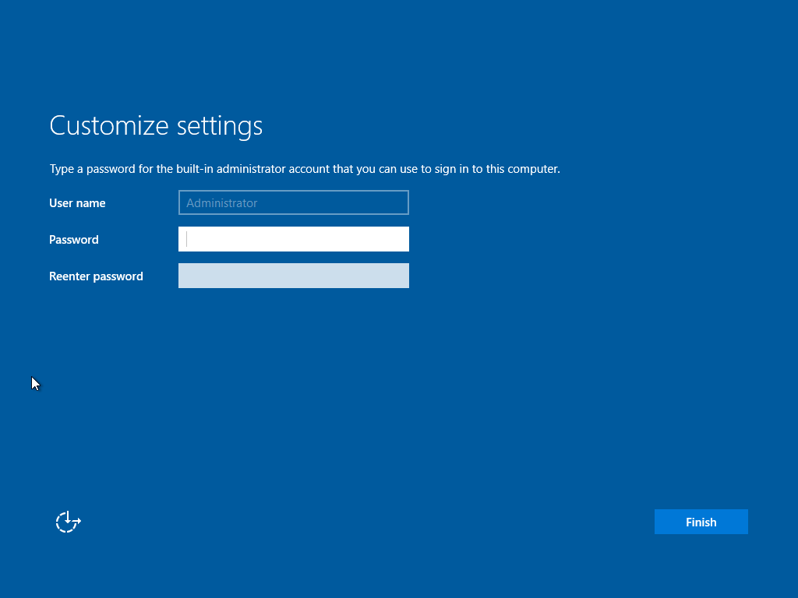
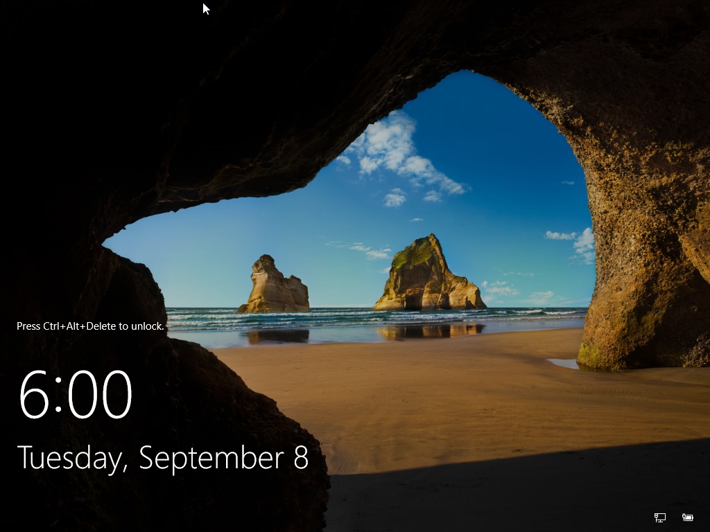

### 1.2 Rename the Server
- Open Server Manager → Local Server → click the current computer name.
- Rename to `Group6-DC01`, restart when prompted.

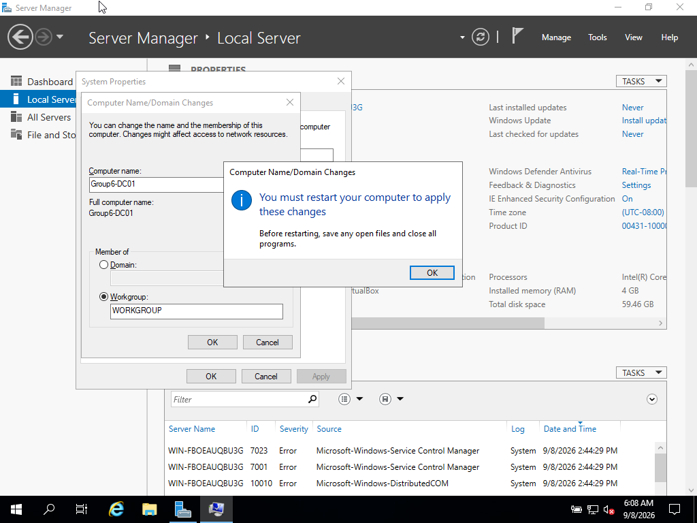

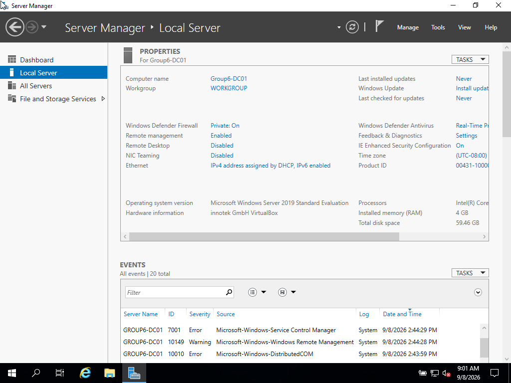

### 1.3 Assign a Static IP Address
- Network and Sharing Center → Change adapter settings → Properties → IPv4.
- Set static IP (192.168.6.10), subnet mask (255.255.255.0), and preferred DNS (self).

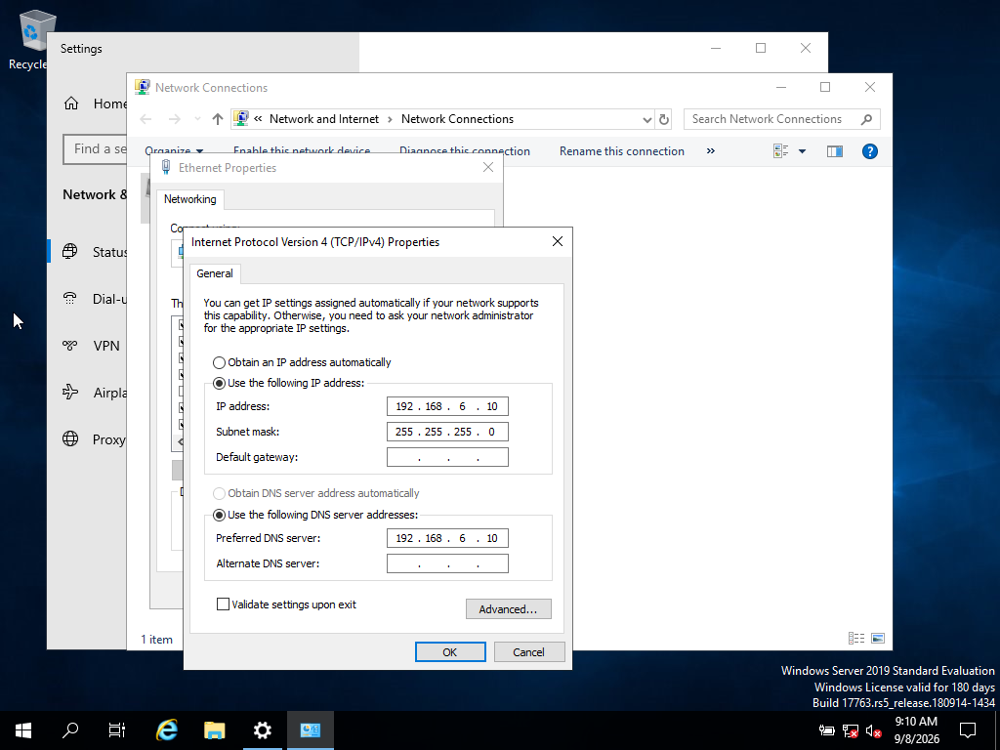

## Testing
- Ran `ipconfig /all` to confirm hostname and IP settings.
- Pinged the server's own address to confirm the network stack was working.

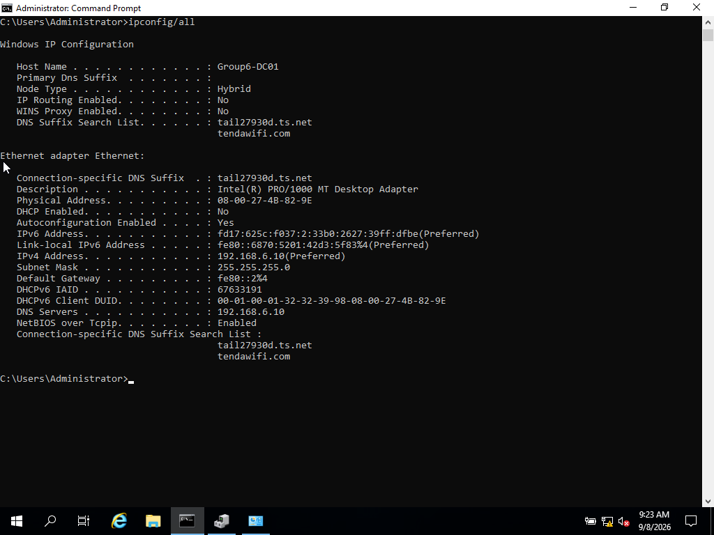
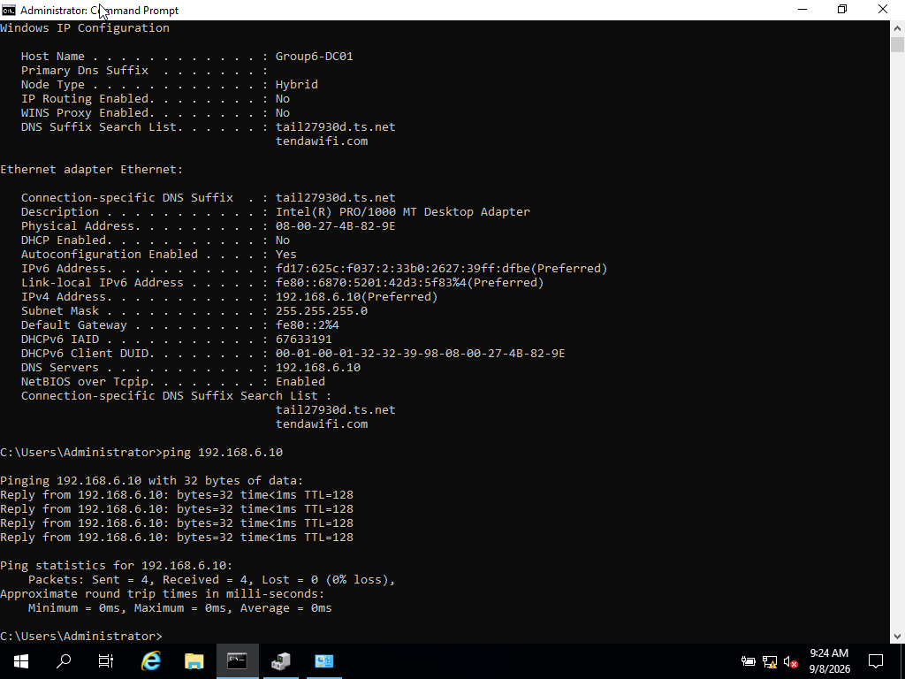

## Notes / Issues Encountered

After joining the client VM to the same VirtualBox Internal Network as the
server, ping tests between the two machines failed intermittently with
"Destination host unreachable" and packet loss, despite correct IP/subnet
configuration on both sides.

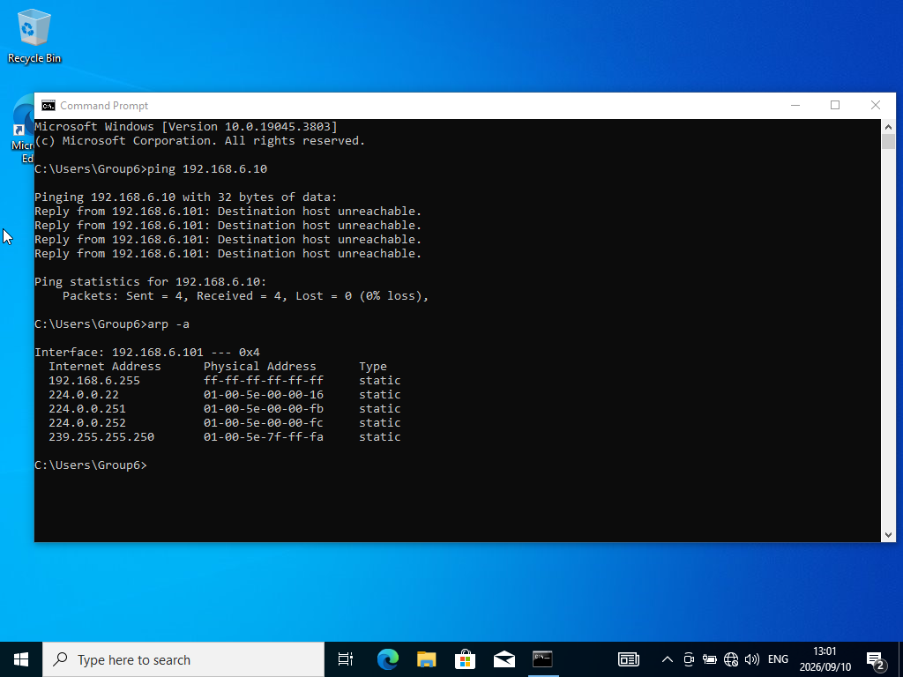

Investigation traced this to Windows 11's Hyper-V/Virtualization-Based
Security (VBS) running on the host machine, competing with VirtualBox for the
CPU's virtualization extensions (VT-x). Software-level fixes (disabling
Hyper-V, Virtual Machine Platform, and Memory Integrity/Core Isolation) did
not fully resolve it — `Get-ComputerInfo -Property "HyperVisorPresent"` still
returned `True`. The root cause turned out to be firmware-level: the host's
BIOS had **Kernel DMA Protection** enabled, which locked the VT-x/VT-d
toggles. Disabling Kernel DMA Protection in BIOS allowed VT-x and VT-d to be
enabled directly at the firmware level.

**Resolution:** Switched both VMs' network adapters from "Internal Network"
to "NAT Network" mode in VirtualBox, and resolved the underlying host
performance issue via the BIOS-level fix above. Together, these changes
resolved the connectivity issue and significantly improved VM responsiveness.

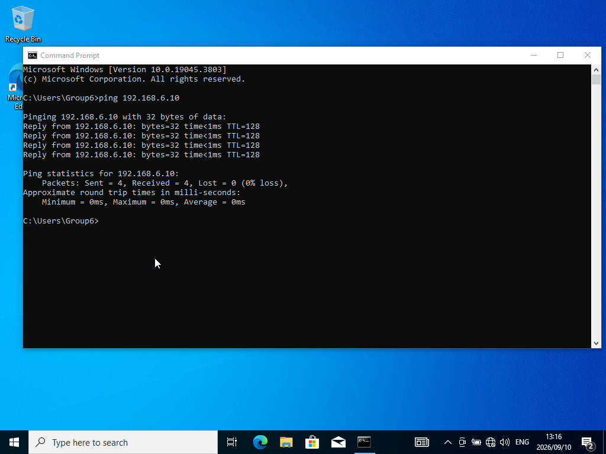
