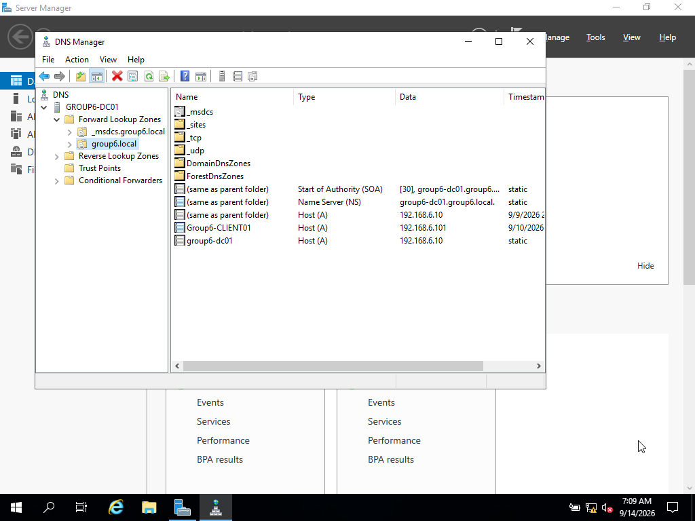
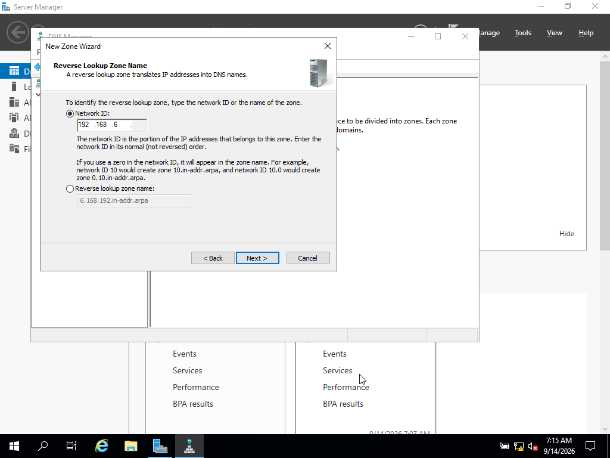
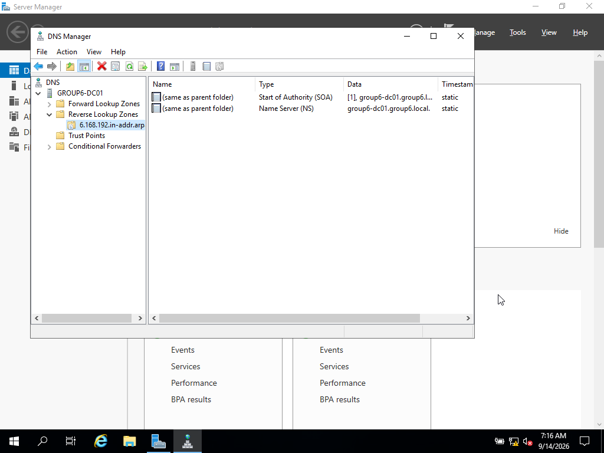
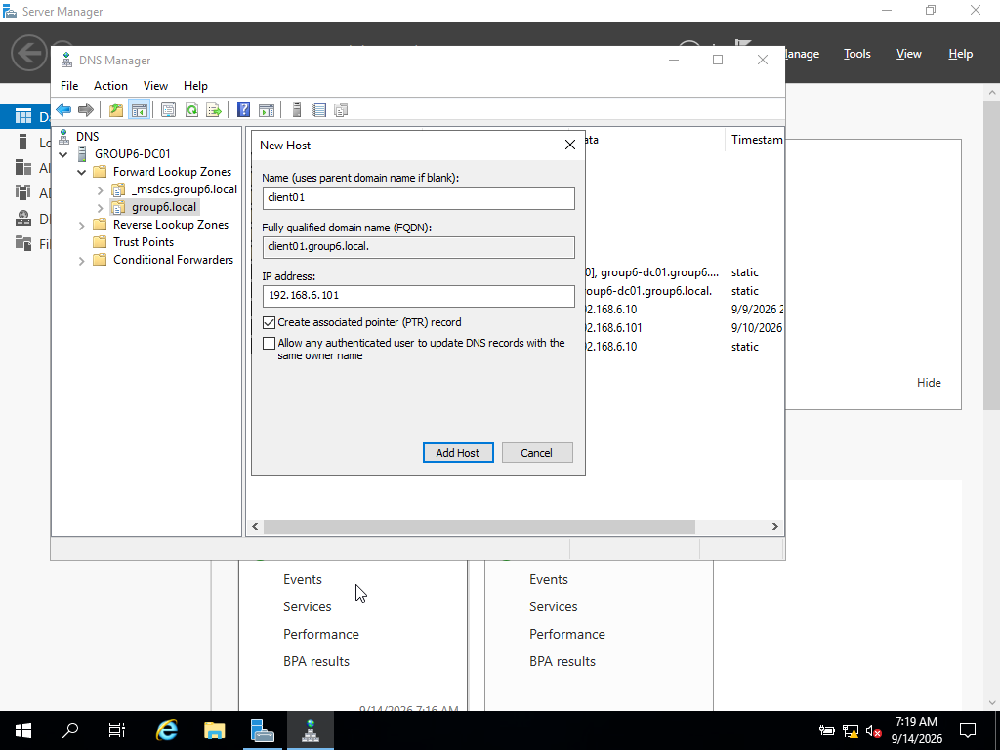
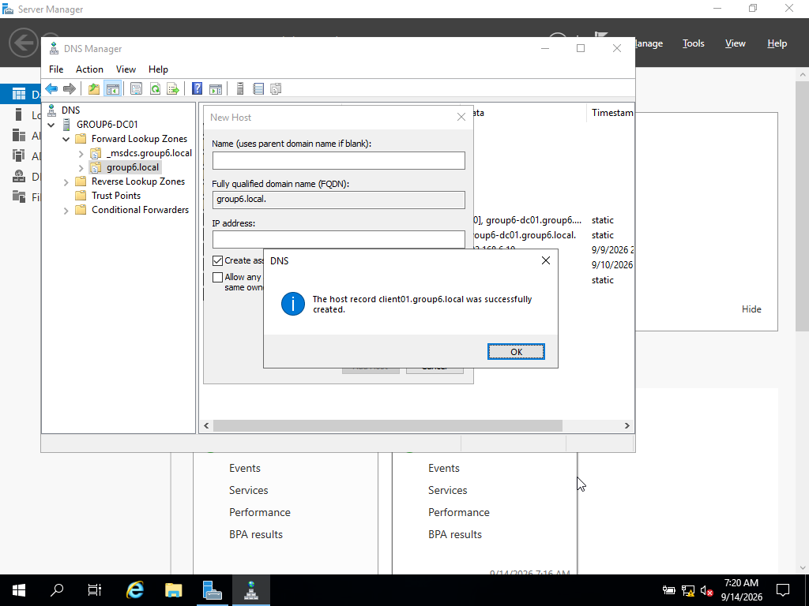
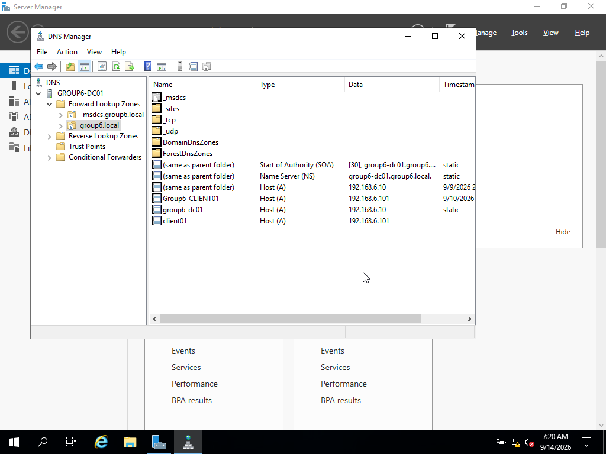
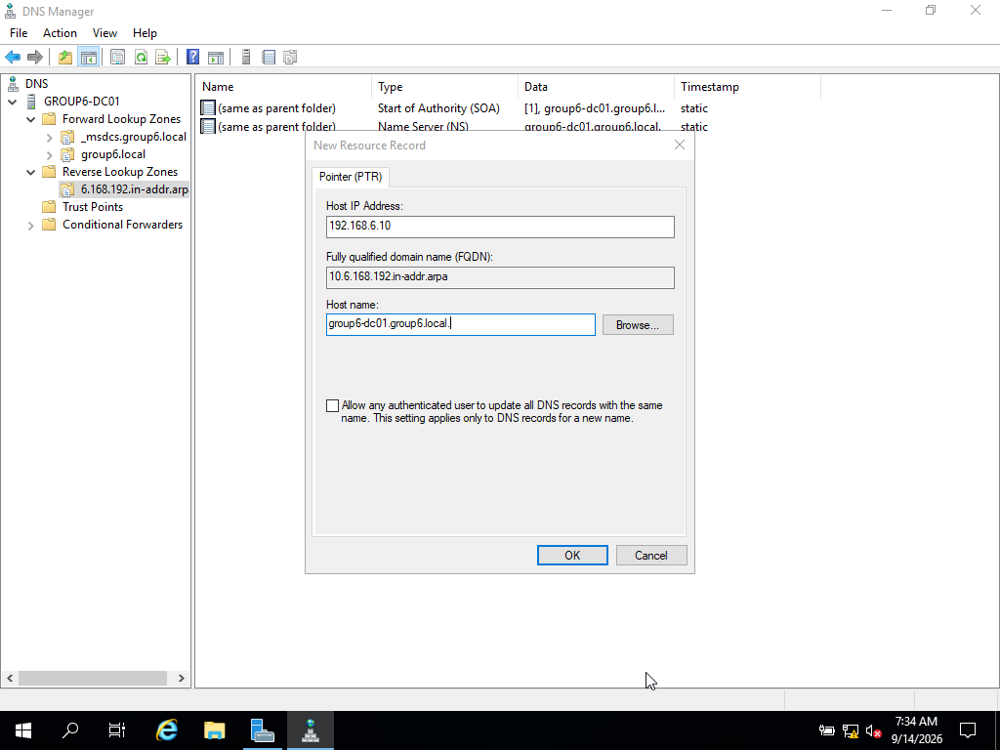
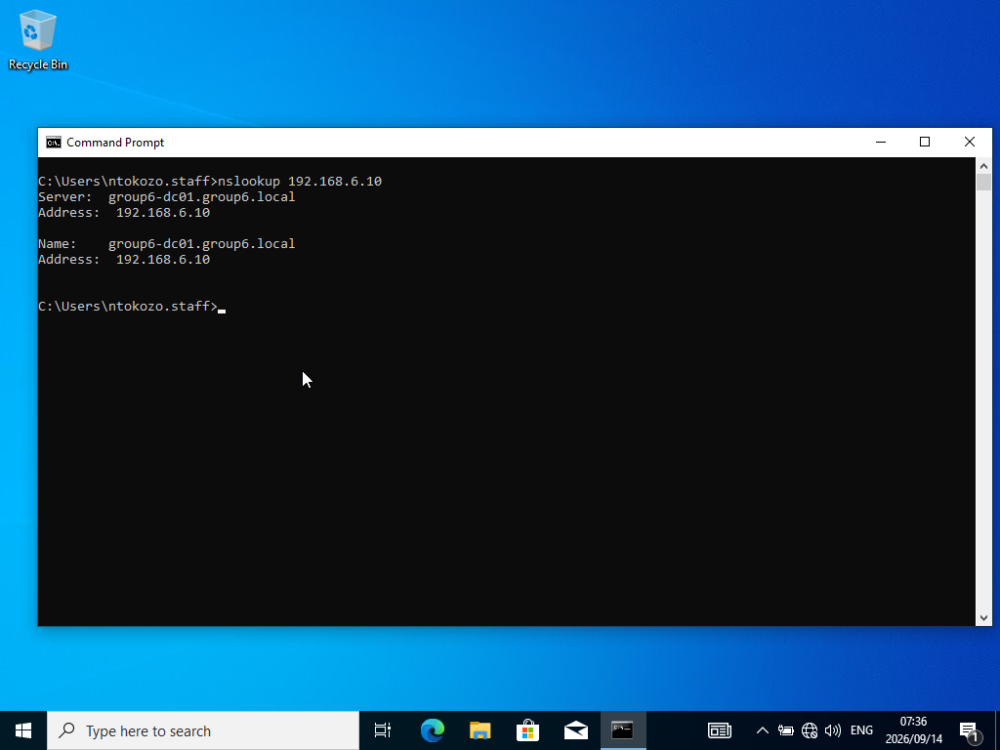

# 3. DNS Configuration (20 marks)

**Owner:** Kungawo Mpengesi
**Status:** ✅ Done

## Objective
Verify the DNS server installed automatically with AD DS, configure a reverse
lookup zone, add manual DNS records, and test both forward and reverse
resolution from a client.

## Steps

### 3.1 Verify Forward Lookup Zone
- Opened DNS Manager on Group6-DC01 (Server Manager → Tools → DNS).
- Confirmed the forward lookup zone `group6.local` exists automatically,
  created during AD DS promotion, along with default SOA, NS, and A records.

### 3.2 Create Reverse Lookup Zone
- DNS Manager → Reverse Lookup Zones → New Zone.
- Configured for subnet 192.168.6.0/24, set to update automatically
  (Active Directory-integrated, secure dynamic updates).

### 3.3 Add DNS Records
- Added an A record manually for the client machine (`client01.group6.local`
  → 192.168.6.101), with an associated PTR record created automatically.

## Testing

- From the client, ran `nslookup group6-dc01.group6.local` and
  `nslookup client01.group6.local` — both resolved to their correct IPs.

- Reverse lookup (`nslookup 192.168.6.10`) initially failed with
  "Non-existent domain," since the reverse zone had no PTR record yet for the
  server's own IP. Manually added a PTR record for `Group6-DC01`
  (192.168.6.10 → group6-dc01.group6.local).

- Re-ran the reverse lookup, which then resolved correctly.

## Notes / Issues Encountered

Creating a reverse lookup zone does not automatically populate PTR records
for existing hosts — it only provides the structure (SOA/NS records). A PTR
record must be manually created (or generated via "Create associated pointer
record" when adding an A record) for reverse lookups to succeed. This was
resolved by manually adding a PTR record for the server's own IP address.
