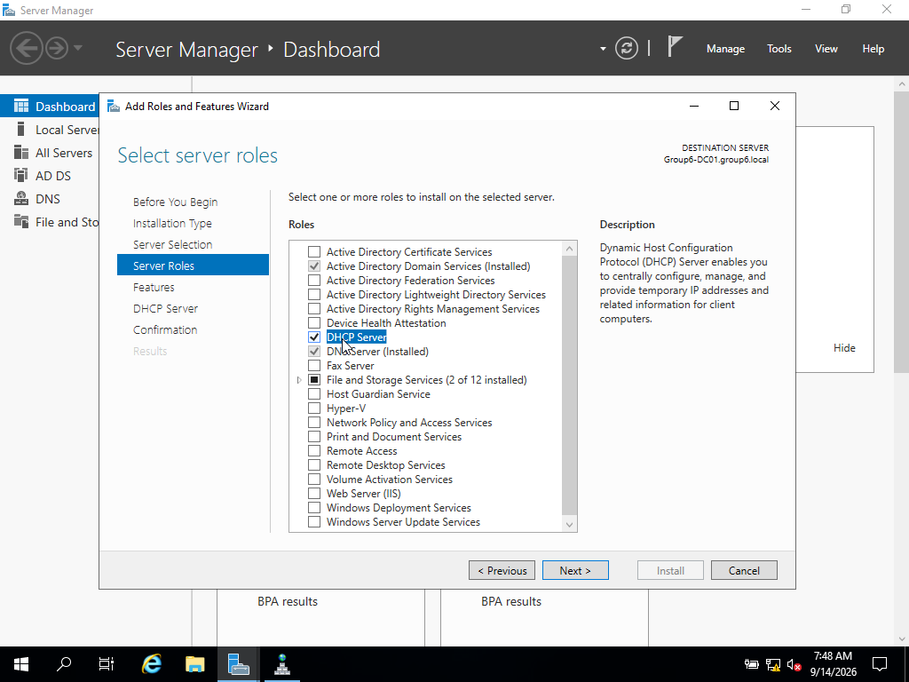
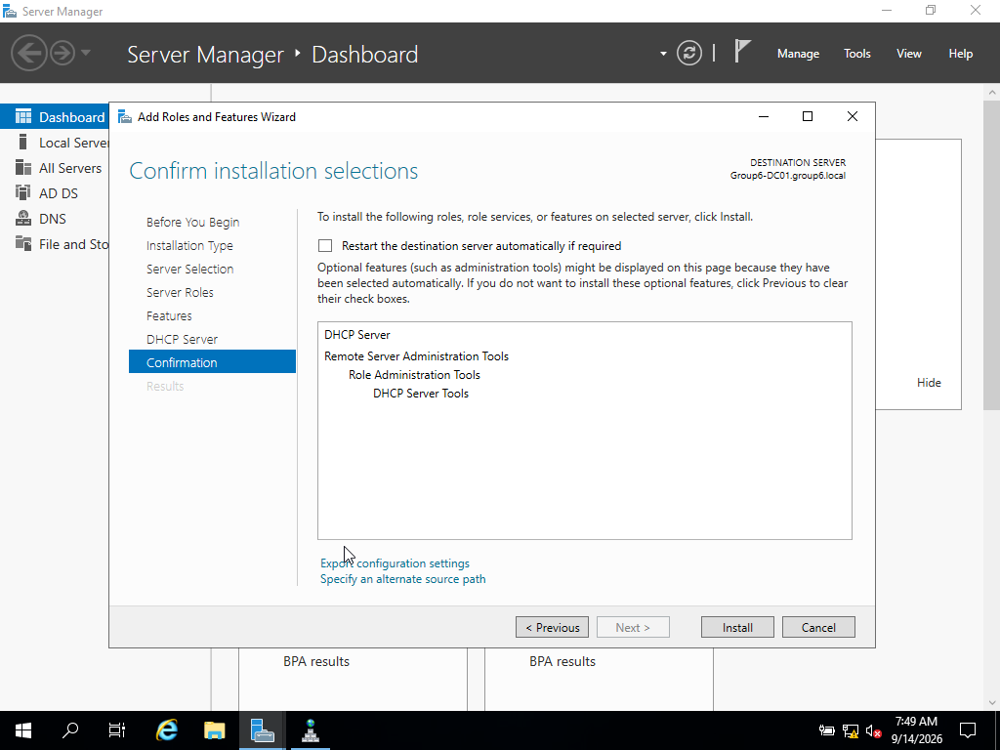
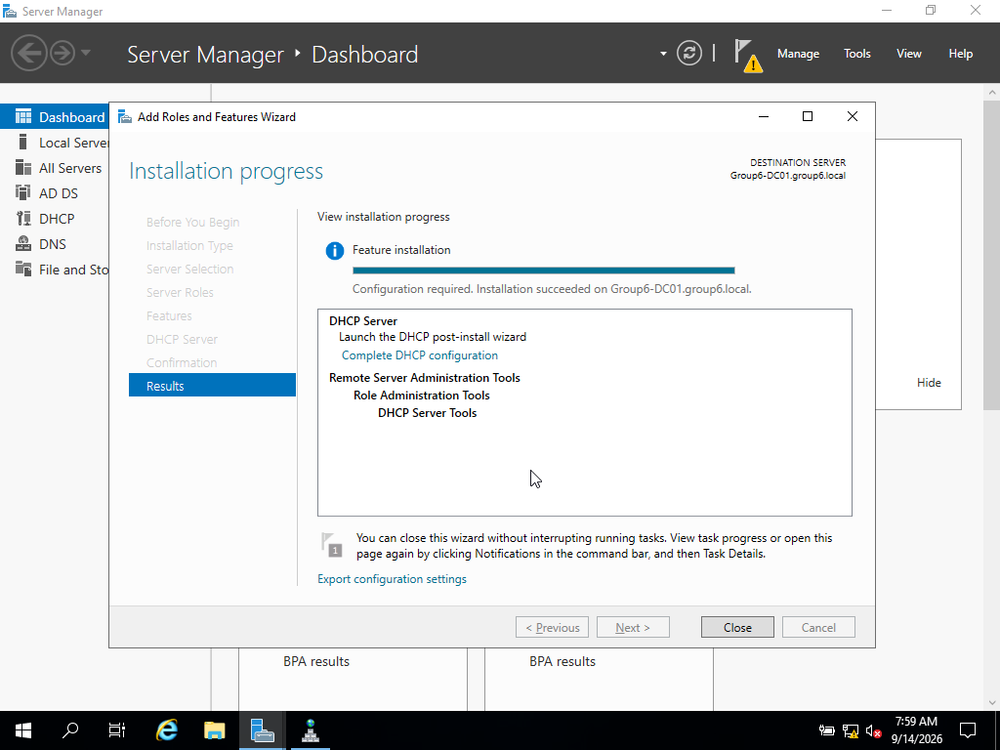
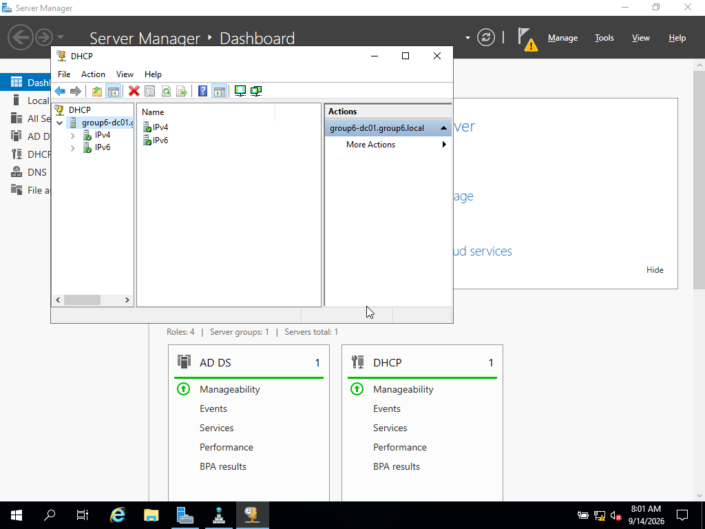
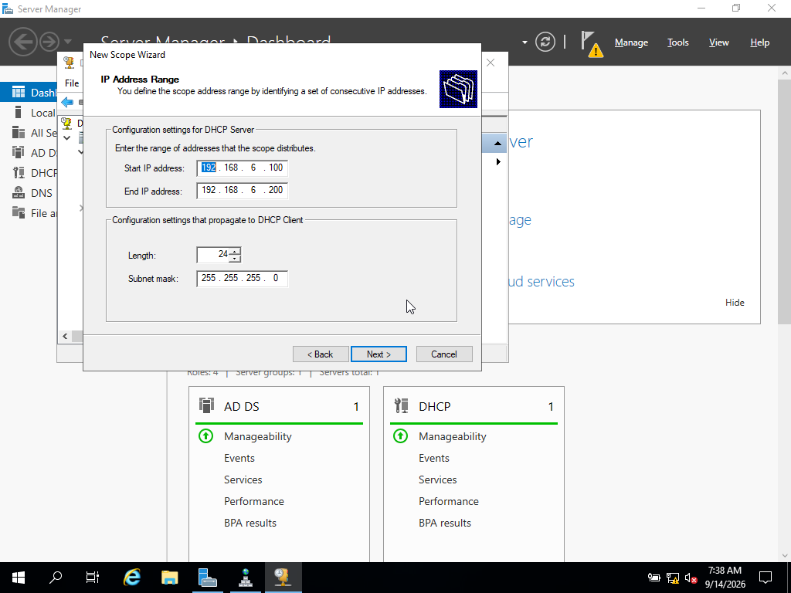
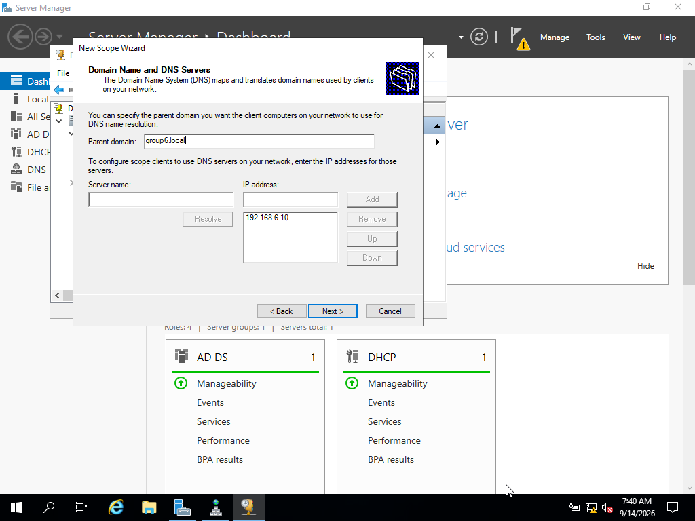
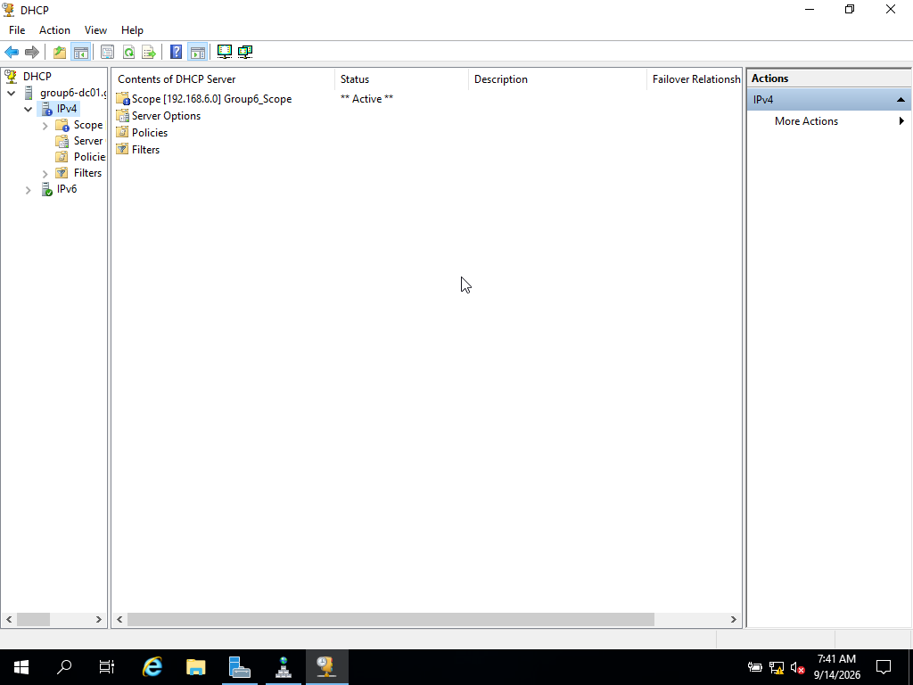
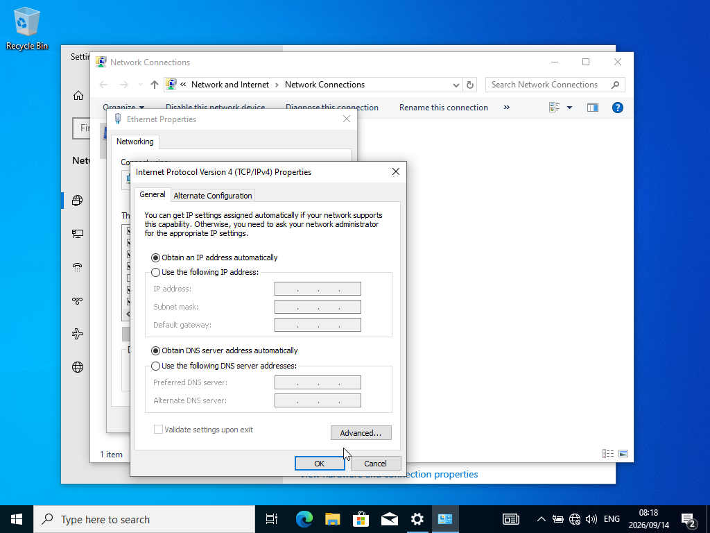
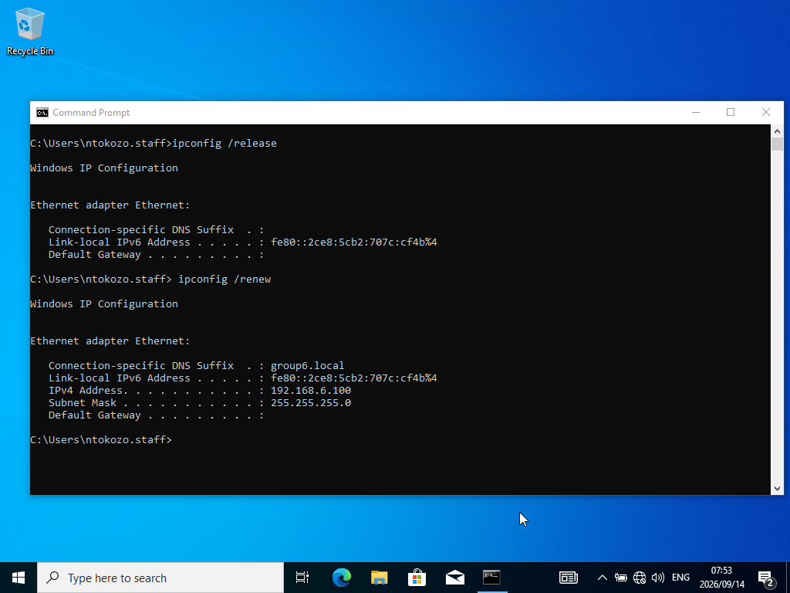
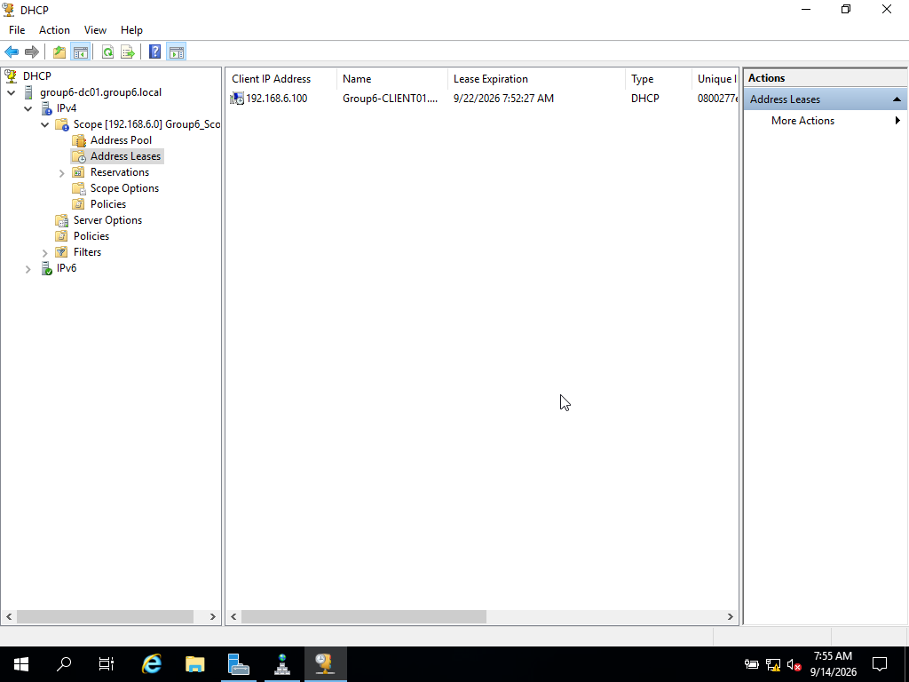

# 4. DHCP Configuration (20 marks)

**Owner:** Ntokozo Tyanase
**Status:** ✅ Done

## Objective
Install the DHCP role, authorize it in Active Directory, create a scope, and
verify a client can automatically obtain a lease.

## Steps

### 4.1 Install DHCP Server Role
- Server Manager → Add Roles and Features → DHCP Server.

### 4.2 Authorize DHCP Server in AD
- DHCP console → right-click server → Authorize.
- Confirmed the server icon shows a green checkmark (authorized).

### 4.3 Create a Scope
- New Scope Wizard: name `Group6_Scope`, IP range 192.168.6.100–200,
  subnet mask 255.255.255.0.
- Excluded 192.168.6.101 (previously used as a manual static IP during
  earlier testing in Sections 1–3).
- Configured DNS options: parent domain `group6.local`, DNS server
  192.168.6.10.
- Scope activated immediately.

## Testing
- On the client, switched the network adapter back to "Obtain an IP address
  automatically" and "Obtain DNS server address automatically" (previously
  set to a manual static IP for earlier domain-join testing).
- Ran `ipconfig /release` then `ipconfig /renew`.
- Client successfully obtained IP address 192.168.6.100 — within the
  configured scope range, and correctly avoided the excluded 192.168.6.101.
- Cross-checked the lease in the DHCP console under Address Leases,
  confirming the entry matched the client.

## Notes / Issues Encountered

While reconfiguring the client's network adapter settings, a User Account
Control prompt requested elevated credentials — the currently logged-in
domain user (`ntokozo.staff`) did not have sufficient local permissions on
the client machine. This was resolved by authenticating with the client's
local Administrator account (`.\Administrator`) at the prompt, after which
the adapter settings could be changed successfully.
