# 5. Group Policy Configuration (10 marks)

**Owner:** Thapelo Vundla
**Status:** ✅ Done

## Objective
Create a Group Policy Object (GPO) enforcing five security requirements, link
it to the domain, and test that each restriction is actually applied on the
client.

## GPO Setup

Group Policy Management → right-clicked `group6.local` → "Create a GPO in
this domain, and Link it here..." Named it `Group6_Security_Policy` and
linked it at the domain level, so it applies to every user and computer in
`group6.local` rather than just one OU.

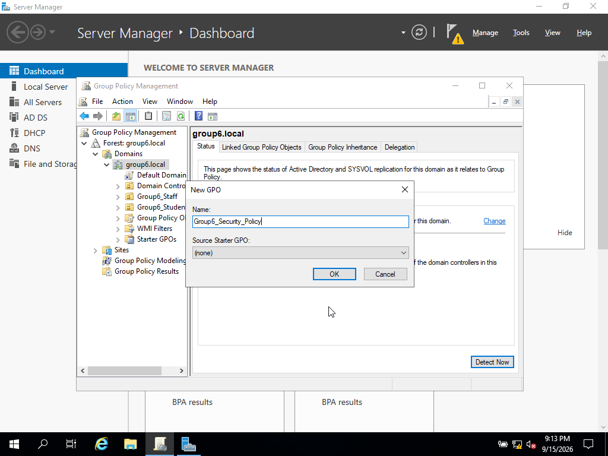
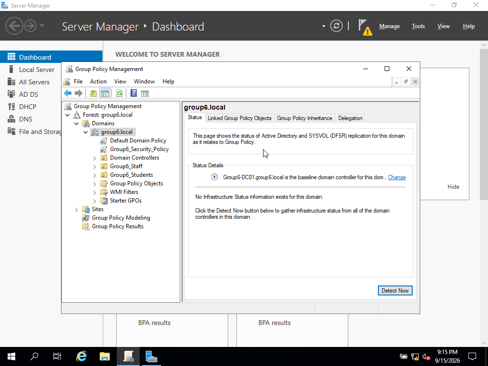

## Policy Settings

### 5.1 Disable Command Prompt
**Path:** User Configuration → Policies → Administrative Templates → System →
*Prevent access to the command prompt* → Enabled

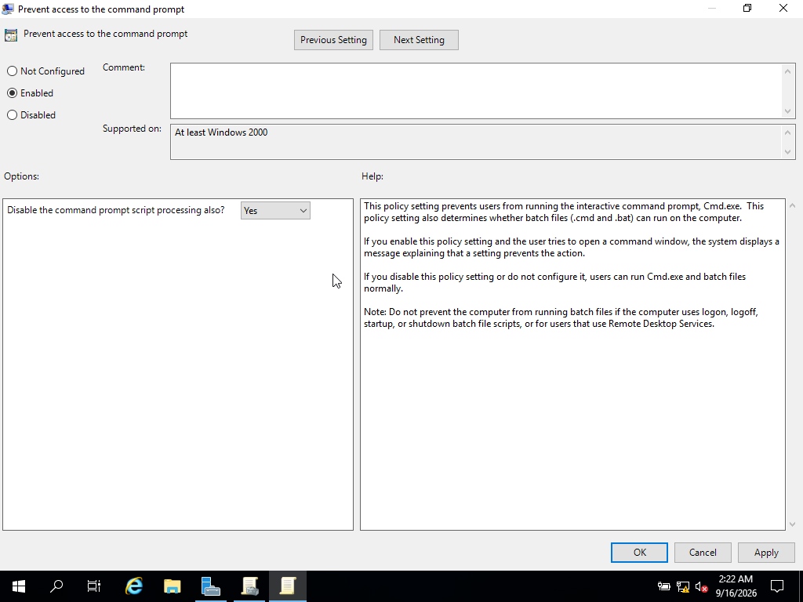

### 5.2 Disable Removable Media / CD / DVD / Floppy
**Path:** Computer Configuration → Policies → Administrative Templates →
System → *Removable Storage Access* → denied read/write access for Removable
Disks, CD and DVD, and Floppy Drives.

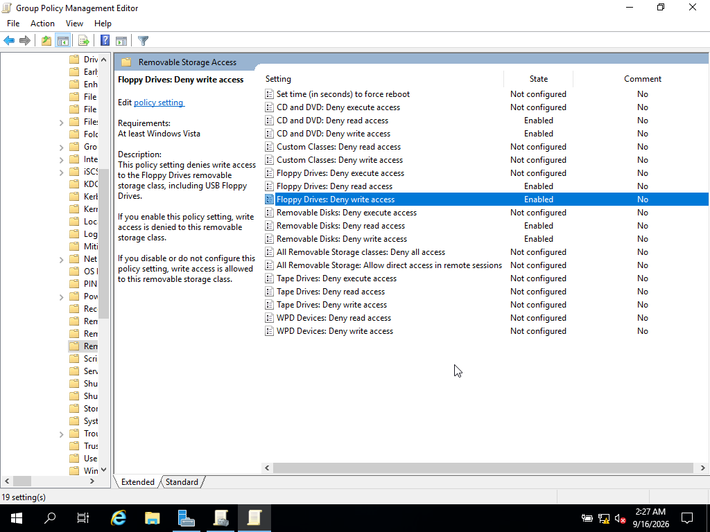

### 5.3 Prevent Software Installation
**Path:** Computer Configuration → Policies → Administrative Templates →
Windows Components → Windows Installer → *Turn Off Windows Installer* →
Enabled, set to "Always."

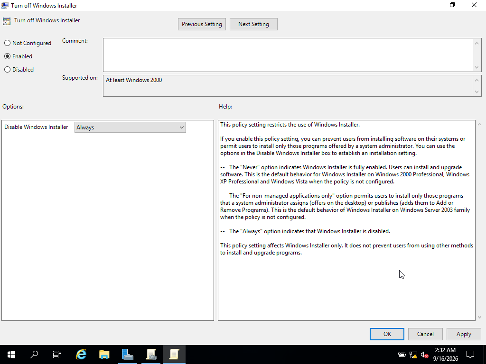

### 5.4 Minimum Password Length (10+ characters)
**Path:** Computer Configuration → Policies → Windows Settings → Security
Settings → Account Policies → Password Policy → *Minimum password length* = 10

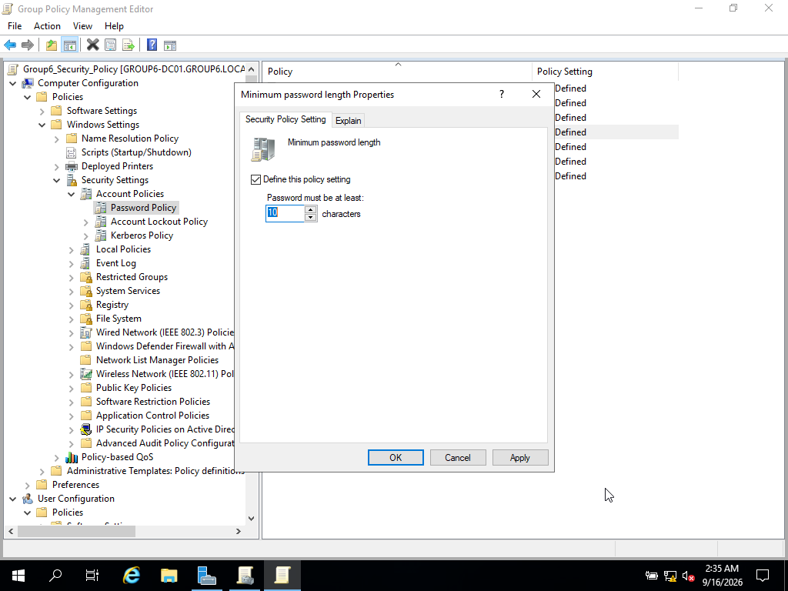

### 5.5 Maximum Password Age (lower than the default 42 days)
**Path:** Same as above → *Maximum password age* = 30 days. Windows
automatically adjusted the minimum password age down to 29 days to keep it
below the new maximum — expected behaviour, not an error.

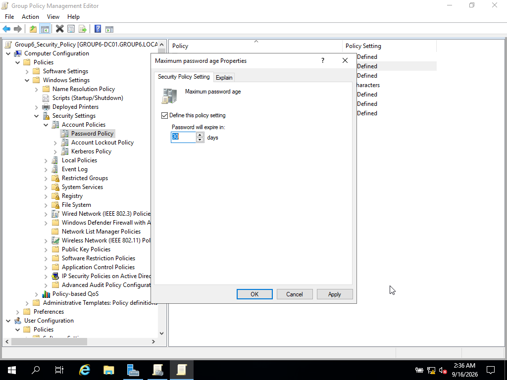

## Testing

Ran `gpupdate /force` on the client via PowerShell (Command Prompt was
already blocked by this point) to confirm the policy had applied.

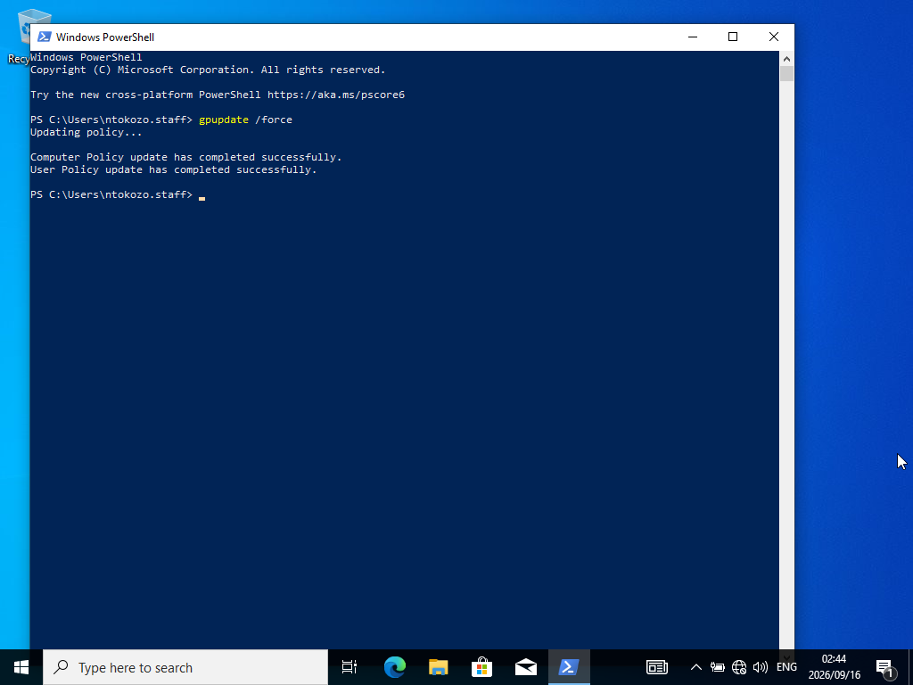

Tried opening Command Prompt on the client — blocked, with a clear policy
restriction message.

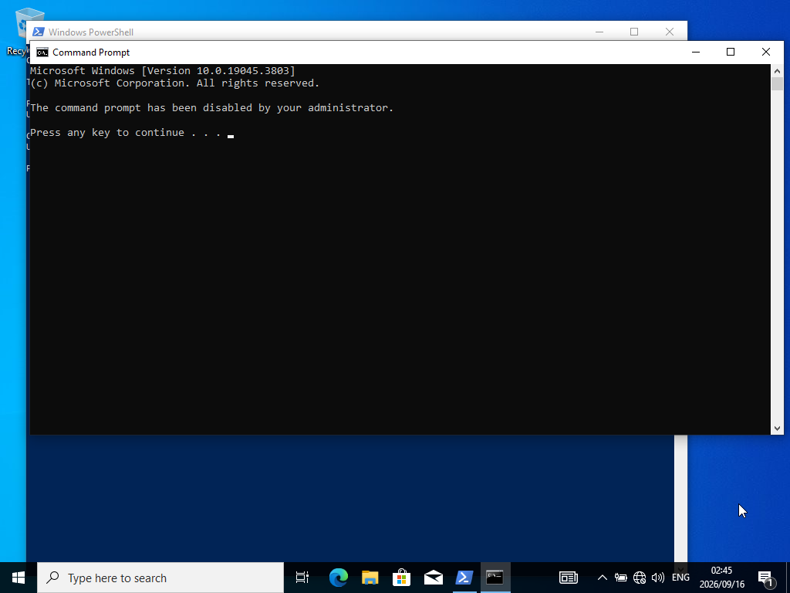

Tried setting a password shorter than 10 characters — rejected. Then tried a
valid password of 10+ characters — accepted without issue.

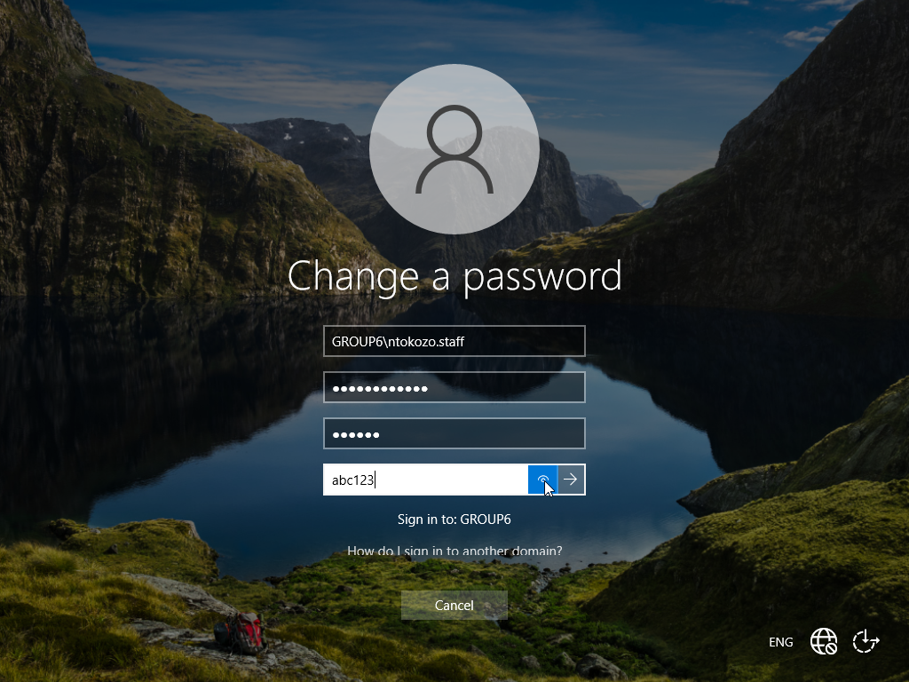
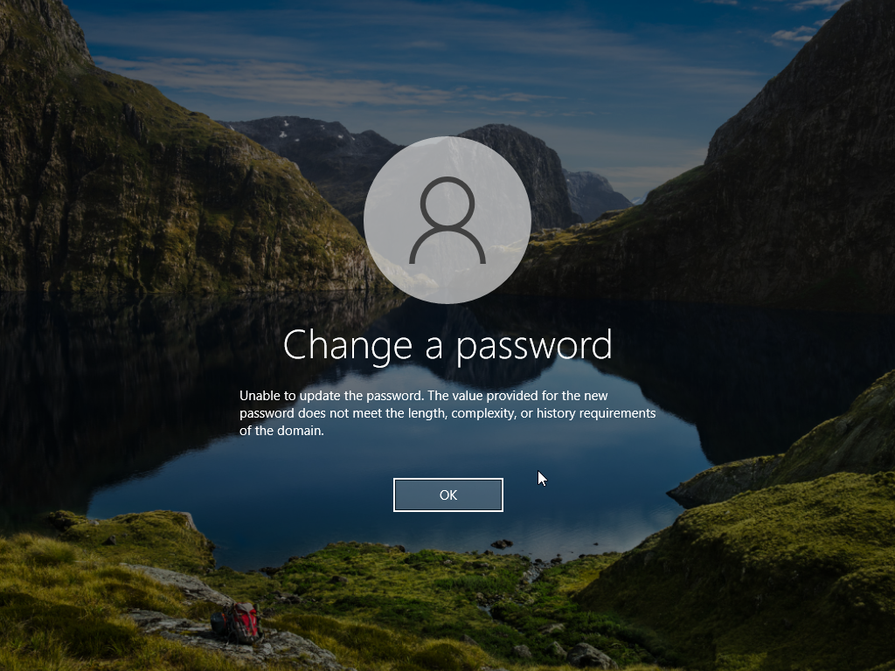

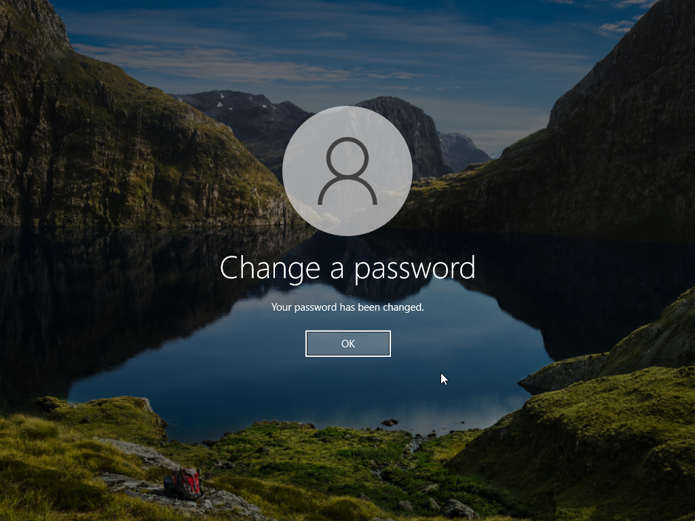

Mounted an ISO to the client's virtual CD/DVD drive and tried browsing it in
File Explorer — access was denied, confirming the removable storage
restriction was actually working, not just configured on paper.

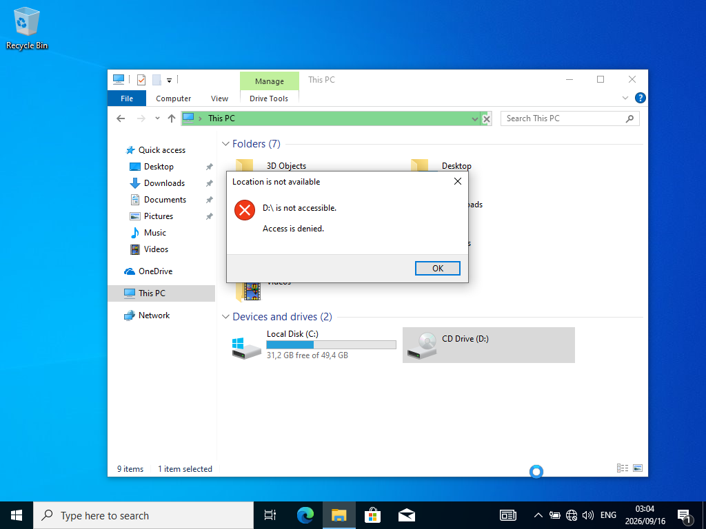

## Notes / Issues Encountered

Tried testing the software installer restriction by enabling a built-in
Windows feature ("Containers") through *Turn Windows features on or off* —
it went through successfully despite the "Turn Off Windows Installer" policy
being active. That turned out not to be a fair test: this particular Windows
feature runs through the DISM/servicing stack rather than the classic Windows
Installer (MSI) service the policy actually targets. The setting itself was
confirmed correctly configured in Group Policy Management; a genuine
MSI-based install test wasn't possible since the isolated lab network had no
external installer packages available to test against.
