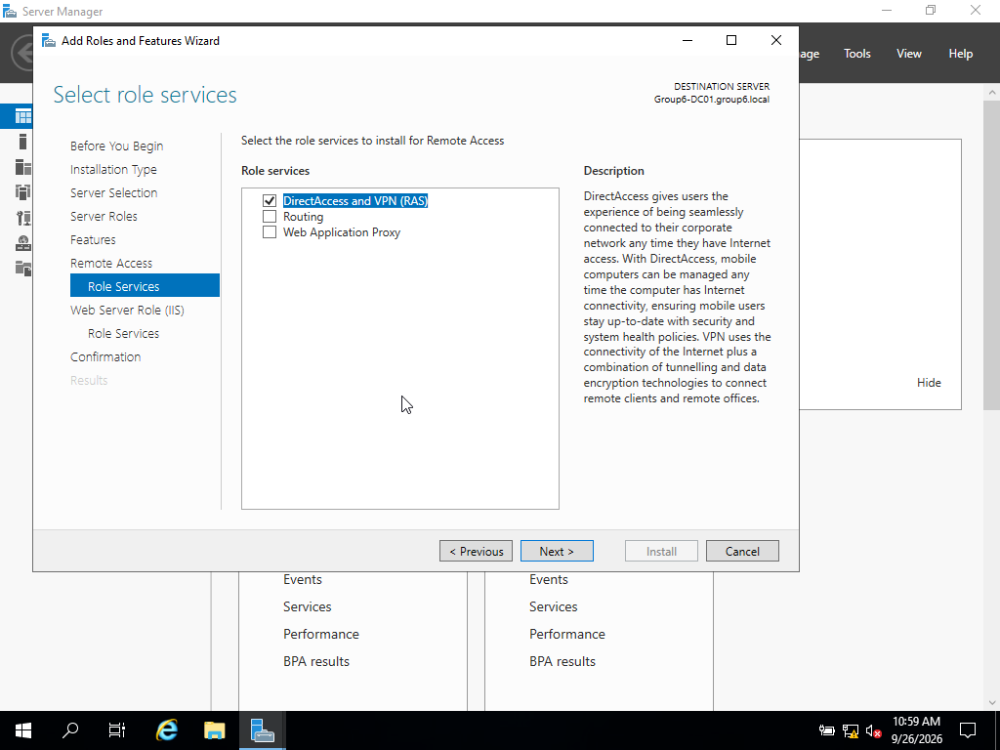
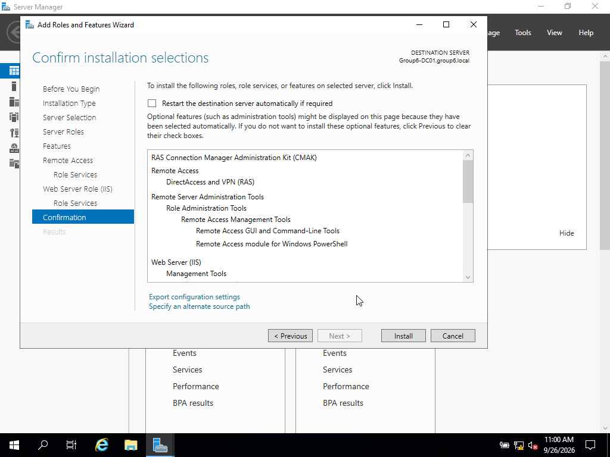
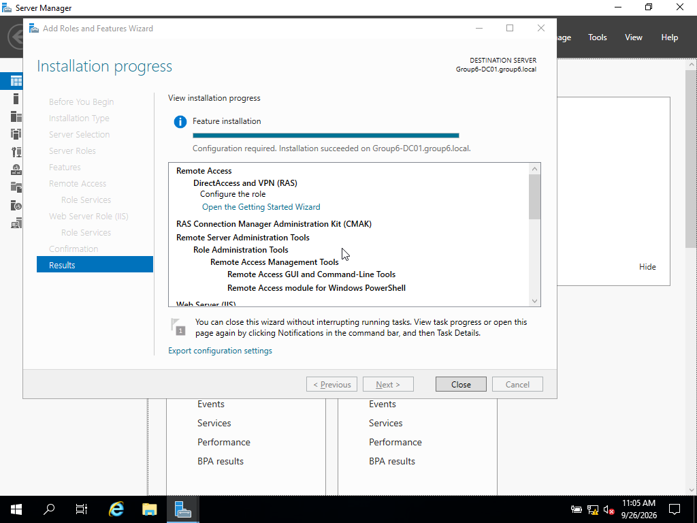
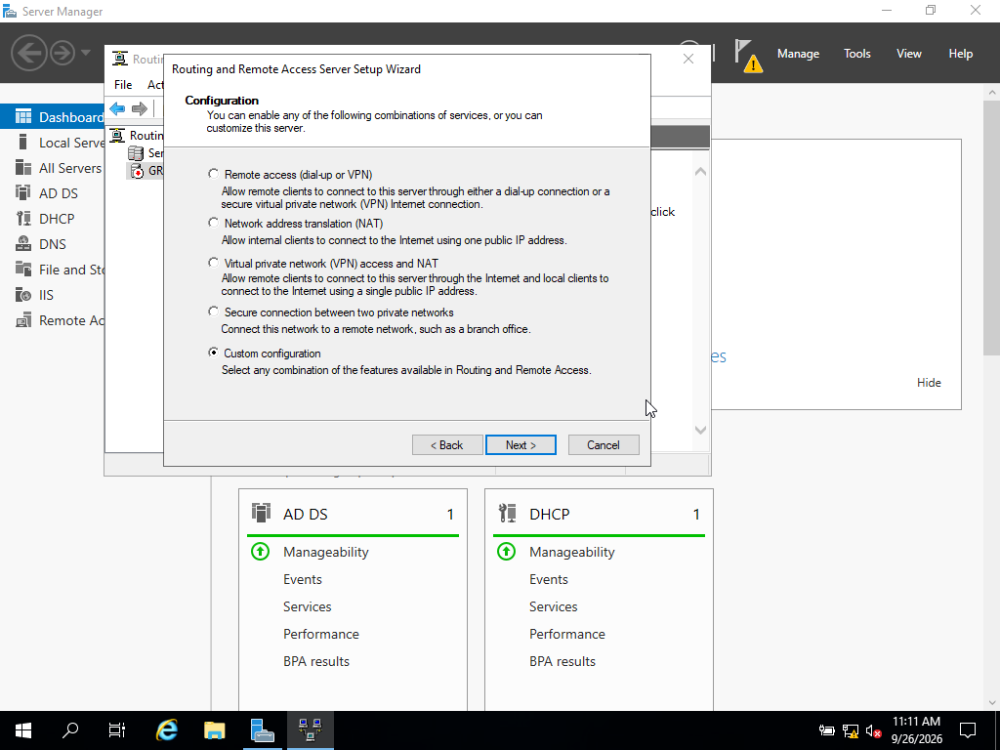
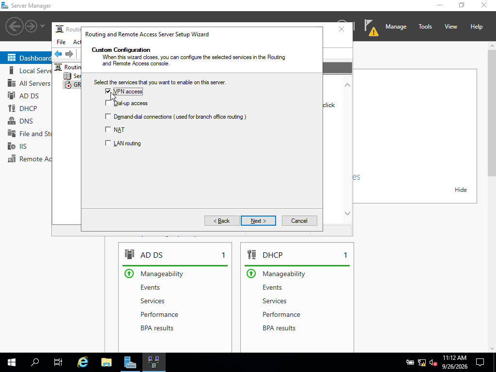
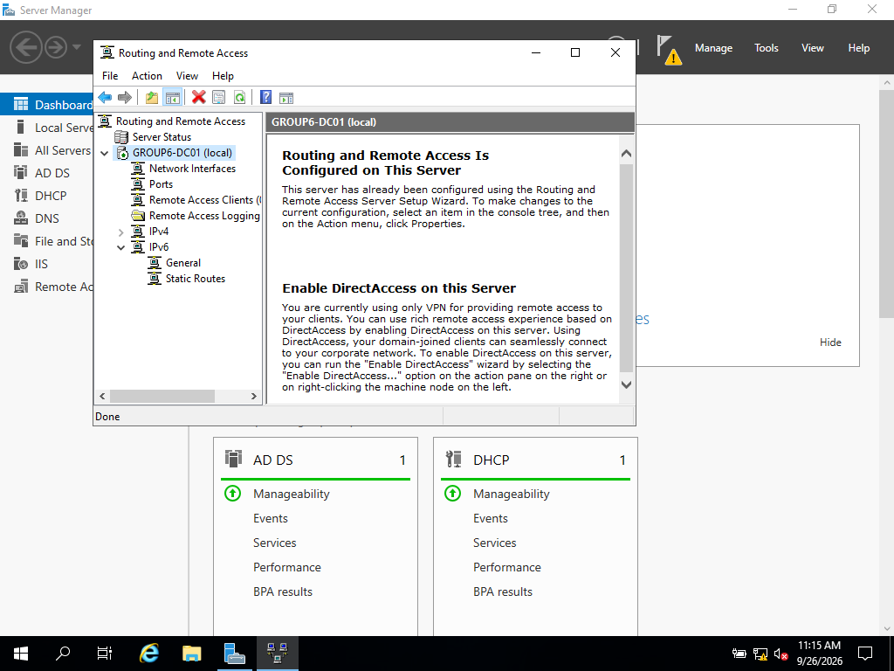
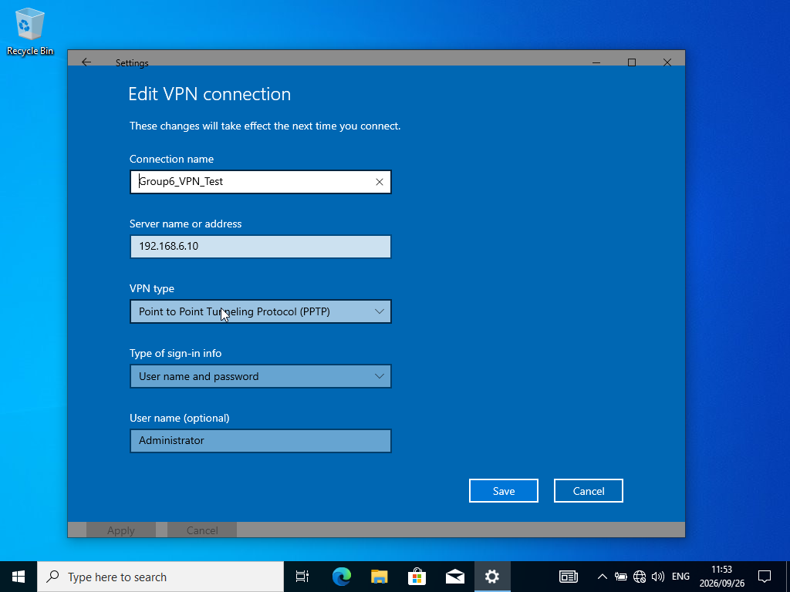
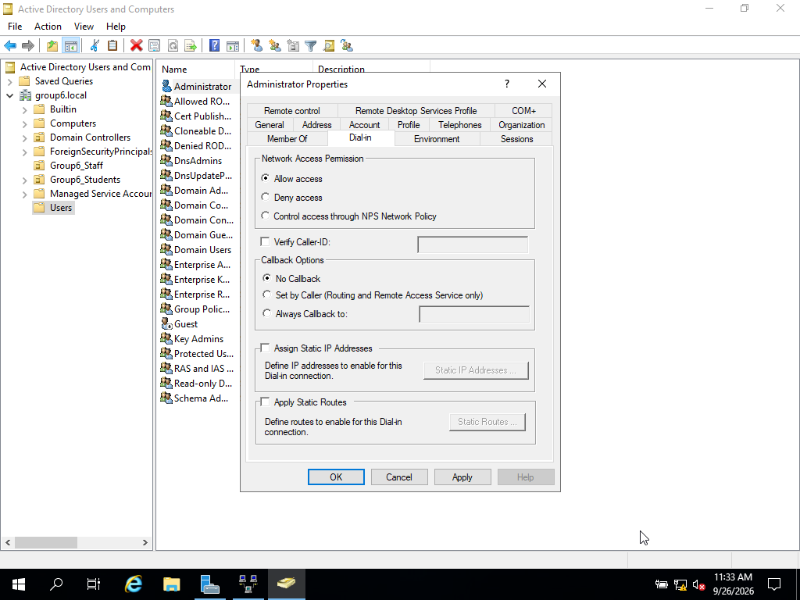
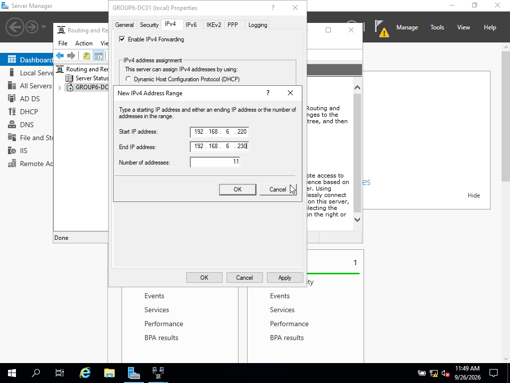
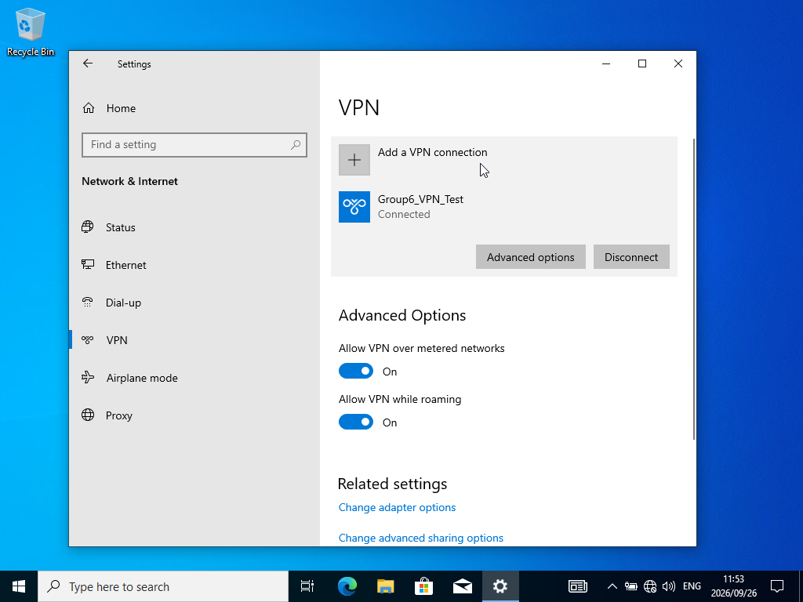

# 6. Remote Access Configuration (10 marks)

**Owner:** Mahlogonolo Mkhawane
**Status:** ✅ Done

## Objective
Install and configure the Remote Access role (RRAS) as a VPN server, and
verify a client can actually establish a VPN connection to it.

## Steps

### 6.1 Install Remote Access Role
Server Manager → Add Roles and Features → Remote Access, with the role
service set to DirectAccess and VPN (RAS).

### 6.2 Configure RRAS
Opened the Routing and Remote Access console (Tools → Routing and Remote
Access), chose "Deploy VPN only," then ran through Custom configuration → VPN
access to set it up, and started the RRAS service.

## Testing

On the client, set up a new VPN connection (Windows built-in VPN type)
pointing at the server's static IP, 192.168.6.10.

Getting this actually working took a few rounds of troubleshooting:

**First attempt** failed with "The remote connection was not made because
the name of the remote access server did not resolve." Turned out to be a
mix of the server address field and the VPN type not being explicitly set —
fixed by re-entering the IP address and setting the VPN type directly to
PPTP.

**Second attempt** failed with "The remote connection was denied because the
user name and password combination you provided is not recognized or the
selected authentication protocol is not permitted on the remote access
server." This one came down to permissions: in Active Directory Users and
Computers, the Administrator account (in the default Users container) had its
Dial-in permission set to "Control access through NPS Network Policy" by
default, which blocks dial-in unless a policy explicitly allows it. Switched
it to "Allow access" instead.

**Third attempt** with PPTP failed with "A connection to the remote computer
could not be established." Tried SSTP as an alternative, which failed
differently — "An existing connection was forcibly closed by the remote
host" — which made sense once it clicked that SSTP needs an SSL/TLS
certificate on the RRAS server, and that hadn't been set up yet (that comes
in Section 7).

Went back and checked the RRAS server's IPv4 address assignment, which was
set to "DHCP." Switched this to a static address pool instead
(192.168.6.220–192.168.6.230), picked specifically to sit outside the
existing DHCP scope (192.168.6.100–200) and avoid any overlap.

Retried the VPN connection with PPTP and `GROUP6\Administrator` credentials —
this time it connected successfully.

## Notes / Issues Encountered

Three separate issues stacked up before the VPN connection actually worked:

1. The server address and VPN type weren't set correctly on the first
   attempt — fixed by re-entering the IP and explicitly choosing PPTP.
2. The domain Administrator account didn't have dial-in permission granted —
   fixed via the Dial-in tab in Active Directory Users and Computers.
3. RRAS was set to assign client addresses through DHCP rather than its own
   dedicated pool, which was quietly preventing the tunnel from establishing
   even after the permission fix — resolved by switching to a static address
   pool kept separate from the DHCP scope.

SSTP was also tried as an alternative protocol along the way, but failed as
expected since it depends on a server-side SSL certificate that hadn't been
configured yet at that point in the project — that gets addressed in Section
7: Certificate Services.
