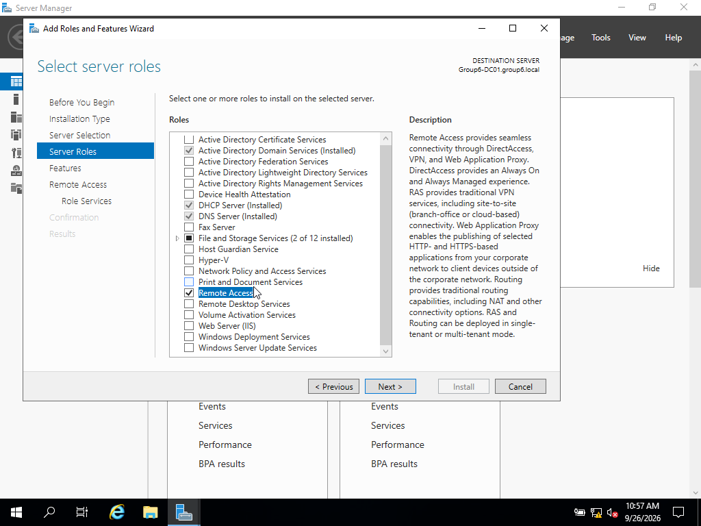

# 6. Remote Access Configuration (10 marks)

**Owner:** [Name]
**Status:** ⬜ Not started / 🟨 In progress / ✅ Done

## Objective
Install and configure the Remote Access role (RRAS) as a VPN server, and verify
a client can establish a VPN connection.

## Steps

### 6.1 Install Remote Access Role
- Server Manager → Add Roles and Features → Remote Access.
- Select role services: DirectAccess and VPN (RAS).

### 6.2 Configure RRAS
- Open Routing and Remote Access console.
- Configure and Enable Routing and Remote Access → Custom configuration → VPN access.
- Set the IP address pool or configure DHCP relay for VPN clients.

## Testing
- From a client machine, create a new VPN connection pointing to the server's IP.
- Attempt to connect and confirm a successful connection status.

> Note: If your lab network is fully isolated, note this limitation and explain
> how the connection was tested within the constraints of your setup.

## Notes / Issues Encountered
- [Add any problems and how you solved them]
